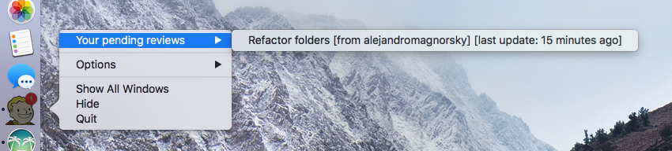

# CanvaBoy

A boy who lives in the dock and gently reminds you that you have incoming reviews. He stays happy when you do your reviews on time (and gets a little grumpy if you don't).

You can right click on CanvaBoy to see a list of all your incoming PR reviews.

Your objective: Keep him happy. :)

### Installation

1. Download the app from [the releases tab](https://github.com/realyze/CanvaBoy/releases), unzip and drag it into the `Applications` folder.
2. Run `git config --global canvaboy.githubToken <Your GH API key>` to add your GitHub API key to your global git config (the token needs the "Repo" permission to be able to read your incoming PRs). You can generate the key [here](https://github.com/settings/tokens). Note: if you use [`git pr-train`](https://github.com/realyze/pr-train), CanvaBoy will use the token from the `.pr-train` file (so you don't need to do anything).
3. Right-click the `CanvaBoy` icon in `Applications` and select `open` to start the app.

The application will automatically start when your computer starts (via [node-auto-launch](https://github.com/Teamwork/node-auto-launch)). (Unless you delete it, of course.)
